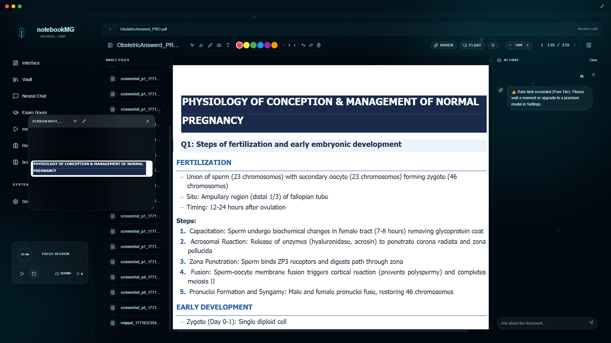
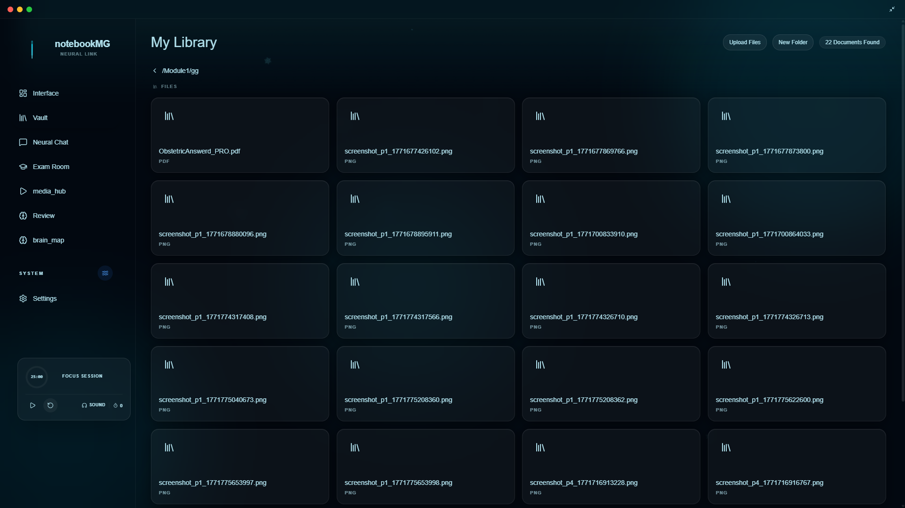
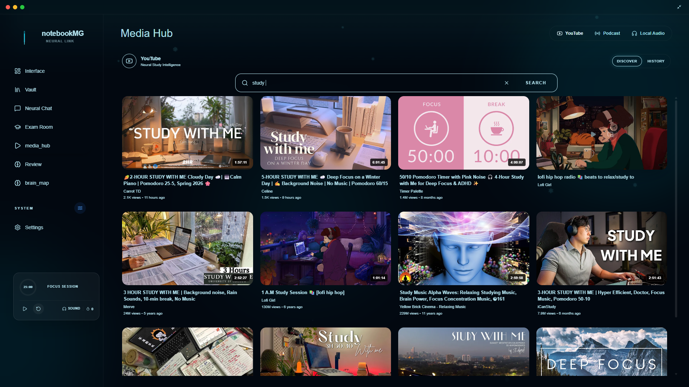

# NotebookMG

**The AI Study System That Replaces Every Tool on Your Desk**

Designed for students who are serious about learning.
Built to eliminate fragmentation, improve retention, and personalize every study session.

---

## The Problem

Modern students don't have a learning problem.
They have a fragmentation problem.

The average student uses 6 or more separate tools to study:
a PDF reader, a note-taking app, a flashcard tool, a video player, a planner, and something else for summaries.

Each switch costs focus. Each disconnected tool loses context.
The result is hours spent managing tools instead of actually learning.

---

## The Solution

NotebookMG is a single AI-powered learning workspace that unifies every study tool into one adaptive system.

It reads your materials, understands your weaknesses, builds your review plan, and tracks your progress — all without switching tabs.

One system. Full context. Nothing lost.

---

## Screenshots

  

  

  

  

---

## Core Features

### Document Intelligence
Upload PDFs, Word files, PowerPoint presentations, or Markdown notes. NotebookMG reads, indexes, and makes every page searchable and interactive.

### AI Learning Engine
Ask questions, get explanations, and generate multiple-choice questions from any section of your material. The AI adapts to the complexity of your content, not the other way around.

### Mistake Tracking & Adaptive Review
Every wrong answer is recorded. NotebookMG identifies your weak points and builds a personalized revision plan that focuses exactly where you need it.

### Spaced Repetition Flashcards
Automatically generated flashcards that adjust their frequency based on your real performance. Proven memory science, applied automatically.

### Podcast Mode
Convert any chapter or document section into a structured 15-minute audio review. Study on your commute, during a walk, or anywhere without a screen.

### Brain Maps
Generate visual knowledge maps from any subject. Understand how concepts connect, where your gaps are, and what the full structure of a topic looks like.

### Readiness Score
A dynamic score that reflects your actual preparation level before an exam. Based on your quiz performance, revision history, and weak areas — not self-assessment.

### Smart Video Transcripts
Watch lectures inside NotebookMG. Click any sentence in the transcript and jump directly to that moment in the video. Turn any segment into a summary, MCQ, or flashcard.

### AI Study Rooms
Invite others into a shared workspace. Discuss material, run group quizzes, and get AI-generated notes that summarize the session.

### Full Vault
Every file, screenshot, note, and session is stored, organized, and linked to the source material. Nothing gets lost. Everything is searchable.

---

## Why NotebookMG

Most EdTech tools are built around content delivery.
NotebookMG is built around how memory actually works.

The system is designed on three principles:

**Active retrieval over passive consumption.**
Reading is not studying. NotebookMG forces engagement through questioning, mapping, and recall.

**Personalization over generalization.**
Every student has different weak points. The system tracks yours and responds to them specifically.

**Integration over aggregation.**
Connecting tools is not the same as unifying them. NotebookMG is built as one system, not a bundle of features.

---

## Roadmap

**Phase 1 — Core Intelligence** `Completed`
AI engine, document reading, mistake tracking, spaced repetition, adaptive review planning.

**Phase 2 — Collaboration & Audio** `In Progress`
AI Study Rooms, Podcast Mode, shared sessions, group review tools.

**Phase 3 — Advanced Analytics** `Upcoming`
Performance dashboards, long-term retention metrics, exam prediction modeling, institution-level reporting.

---

## Launch

Public Beta is now available.
Major feature updates are rolling out continuously.

Subscribe on YouTube for release announcements and full walkthroughs.

---

## Contact

For early access, collaboration, or inquiries:

- Email: mnile23@gmail.com
- YouTube: https://www.youtube.com/@MohamedGomaaPro
- Website: Coming Soon

---

Built for students who take learning seriously.

*NotebookMG — Learn Deeper. Retain Longer. Perform Better.*

